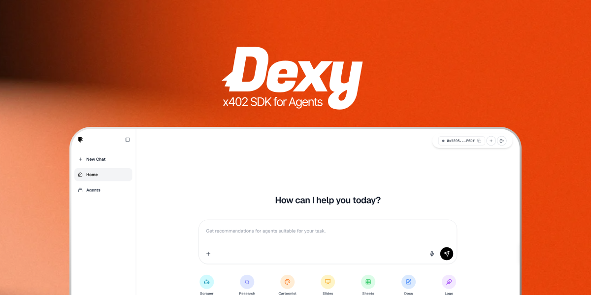

# Dexy

**Dexy** is an enterprise AI agent operations infrastructure layer that enables companies to flexibly swap agents, evaluate them objectively, optimize them automatically, and control costs.

## Core Value Pillars

### 1. Plug-in Agent Execution Layer
Even when new agents or models emerge, they can be swapped in immediately without modifying the entire system. This enables **"migration without redevelopment."**

### 2. ERC-8004–based Benchmarking Layer
Using reputation data and off-chain telemetry (cost, latency, quality), Dexy automatically selects the most optimal agent for each request.

### 3. Cache-aware Execution + Cost-aware Routing
- **Cache-aware Execution:** Identical or similar requests are handled via caching to immediately reduce costs.
- **Cost-aware Routing:** Each request is automatically routed to the agent with the best cost–performance trade-off.

### 4. x402 Automated Payment System
Seamlessly connects M2M calls between agents, enabling a real-time agent economy.

## Core Idea
The core idea is simple: **Dexy is not about AI features themselves, but about building infrastructure that allows AI to be operated reliably at scale.**

## Quick Start (local)

1. Set required environment variables in `.env.local` (API keys, x402 credentials, etc.).
2. Install dependencies and run the dev server:
   ```bash
   npm install
   npm run dev
   ```
3. Open the app and search for an agent to see the recommendation and execution flow.

## Environment

Set these in `.env.local`:

```
NEXT_PUBLIC_SUPABASE_URL=...
NEXT_PUBLIC_SUPABASE_PUBLISHABLE_KEY=...
SUPABASE_SECRET_KEY=...  # service role / secret key for server-side RLS-bypassing calls
OPENAI_API_KEY=...
FLOCK_API_KEY=...
NEXT_PUBLIC_CDP_PROJECT_ID=...
CDP_API_KEY_ID=...
CDP_API_KEY_SECRET=...
BASE_SEPOLIA_RPC_URL=...
BASE_SEPOLIA_USDC_ADDRESS=...
```

Keep secrets out of version control; rotate keys if exposed.

## Contributing

- Open a small scoped PR; include context on the agent or flow you’re changing.
- Add logging when touching ranking, payments, or execution paths; keep sensitive values out of logs.
- For UI, maintain IME-safe inputs and avoid patterns that trigger duplicate sends.
- Run lint/tests if added; note in PR if not run.

## Roadmap

- Expand agent evaluations: richer quality signals, automated test runs, and verified outputs.
- Strengthen payments: more x402 flows, retries, and clear user receipts.
- Better retrieval: multilingual RAG, synonym/intent expansion for matching.
- Agent Registry UX: richer agent profiles, versioning, and trust badges.
- Full M2M: allow agents to chain/compose for complex tasks with minimal human input.
